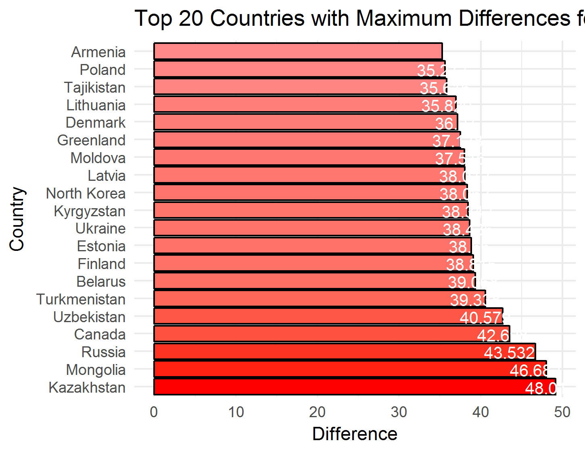
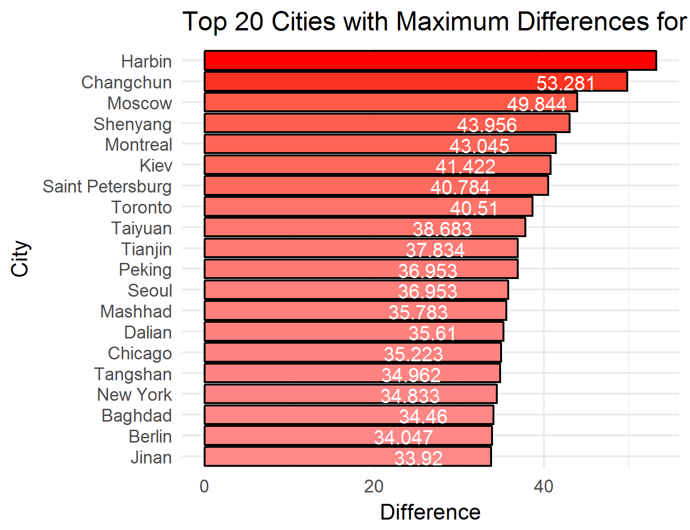

```{r setup, include=FALSE}
knitr::opts_chunk$set(echo = TRUE)
```

#Project Description
The following analyses will focus on two subjects of interest.  First we will examine growth of orange trees by reviewing circumference measurements.  Secondly we will utilize temperature data to examine variances among different countries and cities around the world.

##Orange Tree Analysis

####Introduction
There is a data file available in R which contains circumference measurements for five orange trees.  These measurements are identified by age of the tree in days from a baseline date.  This analysis will show the circumference measurement changes over a timeframe of 1582 days beginning on December 31, 1968 and a final measurement on day 1582 or May 1, 1973.

####Data Gathering
The data can be obtained very simply by calling the dataframe, Orange, from the R console.
```{r,code=readLines('Orange_Data.R'),eval = TRUE}
```

####Data Analysis
We would like to understand more about the circumferences of each tree therefore we will compute the mean and median circumferences from the measurement data. The table below shows the mean and median measurments for each of the five orange trees.
```{r,code=readLines('Orange_Calc.R'),eval = TRUE}
```

####Graphical Examination
To demonstrate the differences in circumferences over the timeframe, we will present two plots that show the data for each tree.  The first plot shows the circumference measurements related to age for each tree.  The second plot shows the range of circumference measurements as separate boxplots for each tree.  
```{r,code=readLines('Orange_Plots.R'),eval = TRUE}
```

####Conclusion
From the analysis, we notice that although each tree begins with a similar circumference measurement, tree number 4 has the highest circumferences over the time period and tree number 3 has the lowest measurements.  The range circumferences of trees 1 and 3 appear to be similar, on a smaller scale, while trees 2 and 4 appear to share similar, larger circumference ranges.


##Temperature Analysis

####Introduction
The question of interest here is to compare and contrast data from two different data sets. The first data set is a series of over 570,000 temperature observations from countries all over the world. The second data set contains over 200,000 observations from 99 large cities around the world. For each data set we analyzed the differences in maximum and minimum temperatures from Janurary 1, 1900 to December 31, 2012. We also created a subset of the temperatures recorded in the US for the previously described time period. We will produce a graph showing the annual change in average temperature over time, as well as show when the greatest year to year change occurred. The final piece of explanatory analysis was to demonstrate graphically the greatest temperature differential for each of the 99 cities in the city data set and graph that difference for the top 20 cities who had the greatest difference. We will then compare the city data chart to the country data chart and comment on the findings. 

###Country Data
####Data Gathering
The data has been provided by the client. We will import the data and do some preliminary exploratory analysis to determine what additional tidying steps will be required.

```{r,code=readLines('TempData.R'),eval = FALSE}
```

####Data Tidying
Some formatting efforts were required to remove NA values and to ensure consistency with dates.  We also want to confine our analysis to the time period specified from January 1, 1900 through December 31, 2012.

```{r,code=readLines('DataCleanUp.R'),eval = FALSE}
```

####Data Analysis
It is necessary to calculate the maximum and minimum temperature values for each country and perform additional tidying for the following analysis.

```{r,code=readLines('MaxandMin.R'),eval = FALSE}
```

####Graphical Examination
We present the top twenty countries with the largest differences between the maximum and minimum teperature measurements.

```{r,code=readLines('Top20Countries_Plot.R'),eval = FALSE}
```


###United States Temperature Changes
We would like to specifically examine the yearly average temperatures for the US and idenify the two years with the largest year-over-year change.  Using the client-provided data we will subset the temperature measurements for the US.

```{r,code=readLines('USTemp.R'),eval = FALSE}
```

We converted the temperatures from the data file to the US measurement standard of degrees in Farenheit and calculated the annual averages from the monthly measurements.

```{r,code=readLines('DegreeF.R'),eval = FALSE}
```

```{r,code=readLines('AnnualLandTemp.R'),eval = FALSE}
```

```{r,code=readLines('ALT_Plot.R'),eval = FALSE}
```


We have identified the following year-over-year variance in average annual temperatures to be .....................

###City Data
####Data Gathering
The data has been provided by the client. We will import the data and do some preliminary exploratory analysis to determine what additional tidying steps will be required.

```{r,code=readLines('CityTemperature.R'),eval = FALSE}
```

####Data Tidying
This section takes the raw data, changes the date formats to a consistent format and then creates a new data frame with the dates specified in the question of interest. We also change a variable name to make it easier to work with as we begin to summarize and manipulate the data.

```{r,code=readLines('CityDataCleanUp.R'),eval = FALSE}
```

####Data Analysis
It is necessary to calculate the maximum and minimum temperature values for each city and perform additional tidying for the following analysis.

```{r,code=readLines('CityMaxandMin.R'),eval = FALSE}
```

####Graphical Examination and Interpretation
We present the top twenty cities with the largest differences between the maximum and minimum teperature measurements.

The questions of interest for this section pertain to the cities of the world with the largest temperature variations. 3 of the top 5 are in China, with 1 each in Russia and Canada. While outside the scope of the current question of interest, it’s interesting that all these cities all above 40 degrees North latitude, and have generally extremely cold winters, while summers are usually mild, although occasionally get very warm, hence the differential.

```{r,code=readLines('Top20Cities_Plot.R'),eval = FALSE}
```


The comparison of the breakdown between country temperature differential and  city differential are interesting, as the top 3 cities don’t appear in the top 2 countries at all. After that, Russia and Canada are represented in the next couple of rankings, with major cities coming in the top 5 for each of them. Further investigation of both data sets shows why this might be. Neither of the top 2 countries have a city listed in the cities list, and so their data doesn’t appear. Looking at a map shows the latitude of both countries to be almost entirely above 40 degrees North, which is strongly correlated with wide temperature variations. As with the city data referenced above, cold winters and occasionally oppressively hot summers account for much of the difference here. 

####Conclusion
