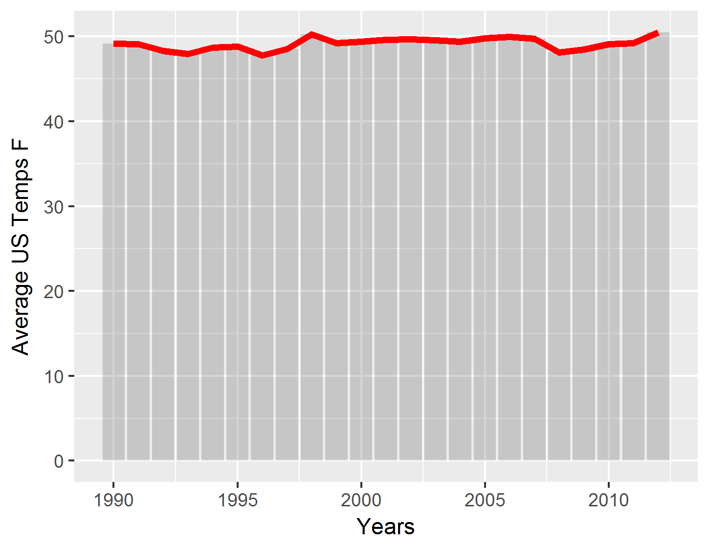

# Orange Tree and Temperature Studies
Joseph Denney, Timothy McWilliams and Laurie Harris  
April 24, 2017  


#Project Description
The following analyses will focus on two subjects of interest.  First we will examine growth of orange trees by reviewing circumference measurements.  Secondly we will utilize temperature data to examine variances among different countries and cities around the world.

##Orange Tree Analysis

####Introduction
There is a data file available in R which contains circumference measurements for five orange trees.  These measurements are identified by age of the tree in days from a baseline date.  This analysis will show the circumference measurement changes over a timeframe of 1582 days beginning on December 31, 1968 and a final measurement on day 1582 or May 1, 1973.

####Data Gathering
The data can be obtained very simply by calling the dataframe, Orange, from the R console.

```r
#Orange Data Gathering
#Assign the Orange dataset in R to the object orange.
#Attach object orange for use in subsequent data analysis.
##Data content:  
##The Orange data set contains 35 observations with 3 columns.  
##Tree is a factor, identifying a particluar tree, 
##Age is number of days from 12/31/1968, and 
##Circumference is numeric value measured in mm.
orange <- Orange
attach (orange)
```

####Data Analysis
We would like to understand more about the circumferences of each tree therefore we will compute the mean and median circumferences from the measurement data. The table below shows the mean and median measurments for each of the five orange trees.

```r
#Calculate mean and median of the trunk circumferences by Tree
#install "plyr" and "pander" packages if not installed
#install.packages ("plyr")
#install.packages ("pander")
#invoke libraries
library(plyr)
library(pander)
```

```
## Warning: package 'pander' was built under R version 3.3.3
```

```r
#Compute mean circumference by Tree
mean <- ddply(orange, .(Tree), summarize, mean=mean(circumference))
mean$mean <- format(mean$mean,digits = 2)
sortmean <- format(mean[order(as.character(mean$Tree)),],2)
#Compute median circumference by Tree
median <- ddply(orange, .(Tree), summarize, median=median(circumference))
sortmedian <- median[order(as.character(median$Tree)),]
#Merge table and display results
meanmed <- merge(x=sortmean, y=sortmedian, by="Tree")
pander(meanmed)
```


----------------------
 Tree   mean   median 
------ ------ --------
  1     100     115   

  2     135     156   

  3      94     108   

  4     139     167   

  5     111     125   
----------------------

####Graphical Examination
To demonstrate the differences in circumferences over the timeframe, we will present two plots that show the data for each tree.  The first plot shows the circumference measurements related to age for each tree.  The second plot shows the range of circumference measurements as separate boxplots for each tree.  

```r
#Create plots
#Scatterplot of tree age vs. circumference
#install ggplot2 if not already installed
#install.packages("ggplot2")
#invoke library
library(ggplot2)
scatter <- ggplot(orange, aes(age,circumference)) + geom_point(aes(color=Tree, shape=Tree)) + xlab("Age (in days from 12/31/1968)")+ ylab("Circumference (mm)")
scatter
```

<!-- -->

```r
#Boxplot of tree circumferences by Tree
box <- ggplot(orange, aes(Tree,circumference))+geom_boxplot()
box
```

<!-- -->

####Conclusion
From the analysis, we notice that although each tree begins with a similar circumference measurement, tree number 4 has the highest circumferences over the time period and tree number 3 has the lowest measurements.  The range circumferences of trees 1 and 3 appear to be similar, on a smaller scale, while trees 2 and 4 appear to share similar, larger circumference ranges.


##Temperature Analysis

####Introduction
The question of interest here is to compare and contrast data from two different data sets. The first data set is a series of over 570,000 temperature observations from countries all over the world. The second data set contains over 200,000 observations from 99 large cities around the world. For each data set we analyzed the differences in maximum and minimum temperatures from Janurary 1, 1900 to December 31, 2012. We also created a subset of the temperatures recorded in the US for the previously described time period. We will produce a graph showing the annual change in average temperature over time, as well as show when the greatest year to year change occurred. The final piece of explanatory analysis was to demonstrate graphically the greatest temperature differential for each of the 99 cities in the city data set and graph that difference for the top 20 cities who had the greatest difference. We will then compare the city data chart to the country data chart and comment on the findings. 

###Country Data
####Data Gathering
The data has been provided by the client. We will import the data and do some preliminary exploratory analysis to determine what additional tidying steps will be required.


```r
# Import the csv file "TEMP"
temp <- read.csv("TEMP.csv", header = TRUE)

# Explore the data to see how data is structured, etc.
head(temp)
summary(temp)
str(temp)
```

####Data Tidying
Some formatting efforts were required to remove NA values and to ensure consistency with dates.  We also want to confine our analysis to the time period specified from January 1, 1900 through December 31, 2012.


```r
# NOTE: there are some NA's present. Will find how many 
row.has.na <- apply(temp, 1, function(x){any(is.na(x))}) #  finds all rows with NA's
sum(row.has.na) # sums up the amount of NA's in dataset
# Drop all rows with NA's
temp2 <- temp[!row.has.na,]
str(temp2)

## The Date variable needs to be changed
#Remove all the dashes in the date column
temp2$Date <- gsub("-","",temp2$Date)
#Remove all the slashes in the date column
temp2$Date <- gsub("/","-",temp2$Date)

# Create a new column called Flag and fill w/1
temp2$Flag <- 1
#Check every row in the data set to see if the date starts w/ 18, if so set flag to 0
temp2$Flag [(substr (temp2$Date, start = 1, stop = 2)== "18" )] <-0
#Check every row in the data set to see if the date starts w/ 17, if so set flag to 0
temp2$Flag [(substr (temp2$Date, start = 1, stop = 2)== "17" )] <-0

# Create a data frame that holds all data where flag is equl to 1, date > 1900
temp3 <- subset(temp2, Flag == 1)
```

####Data Analysis
It is necessary to calculate the maximum and minimum temperature values for each country and perform additional tidying for the following analysis.


```r
# Find the Max and Min monthly average temperatures for each country
Max <- ddply(temp3, .(Country), function(x) max(x$Monthly.AverageTemp))
Min <- ddply(temp3, .(Country), function(x) min(x$Monthly.AverageTemp))
```


```r
# Merge Max and Min data frames
Merged.data <- function(x,y){
  MonAvTempFinal <- merge(x, y, by="Country") # merge the 2 data frames by Country
  rownames(MonAvTempFinal) <- MonAvTempFinal$Row.names
  MonAvTempFinal$Row.names <- NULL
  return(MonAvTempFinal)
}
MonAvTempFinal <- Reduce(Merged.data, list(Max, Min))

# Rename the variables to the correct names of Max and Min
names(MonAvTempFinal)[names(MonAvTempFinal)=="V1.x"] <- "Max"
names(MonAvTempFinal)[names(MonAvTempFinal)=="V1.y"] <- "Min"

# Add a new column to the df that holds the difference in Max and Min for all countires
MonAvTempFinal$Diff <- MonAvTempFinal$Max - MonAvTempFinal$Min

# Sort the df decending by Diff
MonAvTempFinal <- MonAvTempFinal[order(-MonAvTempFinal$Diff),]

# Check the df
head(MonAvTempFinal)
str(MonAvTempFinal)
```

####Graphical Examination
We present the top twenty countries with the largest differences between the maximum and minimum teperature measurements.


```r
# Select the first 20 rows 
Top20 <- MonAvTempFinal[1:20,]

# Attach the df 
attach(Top20)

# Drop the colunms with the Max and Min, it's easier to plot this way
Max <- NULL
Min <- NULL

# Plot the top 20 countires with the heightest difference

# Barplot
Top20Contires <- ggplot(Top20, aes(x=reorder(Country,-Diff), y=Diff, fill = Diff))+ 
                  geom_bar(colour="black", position=position_dodge(), stat = "identity")+ # bars with black outline that are touching eachother. stat argument is for the Country varible since it is a factor
                  scale_fill_gradient(low = "#FF8888", high = "#FF0000")+ # red gradient 
                  geom_text(aes(label=Diff), vjust=1.6, color="white", position=position_dodge(0.9), size=3.5)+ # put value of Diff in top portion of the bar for each Country
                  labs(x = "Country", y = "Difference", title = "Top 20 Countries with Maximum Differences for the Period Since 1900")+
                  theme_minimal()+ # the type of theme of the graph layout
                  theme(legend.position = "none") # remove all leends from graph

print(Top20Contires)
ggsave("countryplot.png")
```


###United States Temperature Changes
We would like to specifically examine the yearly average temperatures for the US and idenify the two years with the largest year-over-year change.  Using the client-provided data we will subset the temperature measurements for the US.


```r
#Create a subset with just the US Readings
temp4 <- subset(temp2, Country == "United States")

#Subset based on only dates after 12/31/1899
USTemps <- subset(temp4, Flag == 1)
```

We converted the temperatures from the data file to the US measurement standard of degrees in Farenheit and calculated the annual averages from the monthly measurements.


```r
#Rename Monthly AverageTemp to get rid of spaces
names(USTemps)[names(USTemps)=="Monthly.AverageTemp"] <- "CTemp"

#Create new column FTemps - CTemp in Farenheit, calculate value and write
USTemps$FTemp <- (USTemps$CTemp *1.8) + 32
```


```r
#Convert Date column from character to Date format (YYYY-mm-dd)
USTemps$Date <- as.Date(USTemps$Date,"%m-%d-%Y")

#Create Year column to group by for average Calculations
USTemps$Year <- year(USTemps$Date)

#Delete partial year values for 2013
USTemps <- subset(USTemps,Year != 2013)

#Group by Year
Years_Group <- group_by(USTemps,Year)

#Summarize by year and calculate average temp in Farenheit
Years_Temp <- summarize(Years_Group, sum(FTemp)/12)

#Write value as a stored colum
Years_Temp$FTemp <- Years_Temp$`sum(FTemp)/12`

# Subset dataframe to show years => 1990
US1990 <- Years_Temp[which(Years_Temp$Year>=1990),]
```


```r
#Print bar graph by year
ALt <- ggplot(data = US1990, aes(x=Year, y= FTemp)) +geom_bar(stat="identity", alpha=0.25) +guides(fill = FALSE) +xlab("Years") + ylab("Average US Temps F") +geom_line(colour="red", size=1.5)
print(ALt)
ggsave("altplot.png")
```


We would like to examine the changes in average temperature year over year. 


```r
i <- Years_Temp$Year[1]#Year variable
x <- 1 #Counter Variable
while (i <= 2011){
  #Insert Years being Calculated into Years_Temp
    Years_Temp$Diff.Year[x] <-  paste(Years_Temp$Year[x],"-", Years_Temp$Year[x+1])
    Years_Temp$Diff[x] <- abs(Years_Temp$FTemp[x] - (Years_Temp$FTemp[x+1]))
  #y <- paste(Years_Temp$Year[x],"-", Years_Temp$Year[x+1], " " , abs(Years_Temp$FTemp[x] - (Years_Temp$FTemp[x+1])))
    i = i +1
    x= x+ 1
}
Years_Temp_Sorted <- Years_Temp[ order(-Years_Temp[,5]), ]
paste(Years_Temp_Sorted$Diff.Year[1], "-", Years_Temp_Sorted$Diff[1])
```

We have identified the following year-over-year variance in average annual temperatures to be the largest between the years 1920-1921 with a variance of 2.54 degrees Farenheit.

###City Data
####Data Gathering
The data has also been provided by the client. We will import the data and do some preliminary exploratory analysis to determine what additional tidying steps will be required.


```r
CityTemp <- read.csv("CityTemp.csv", header = TRUE)
#Create working copy of data
CityTemp2 <- data.table(CityTemp)
```

####Data Tidying
This section takes the raw data, changes the date formats to a consistent format and then creates a new data frame with the dates specified in the question of interest. We also change a variable name to make it easier to work with as we begin to summarize and manipulate the data.


```r
# Remove unneeded columns
CityTemp2[, c("Latitude","Longitude","Monthly AverageTemp Uncertainty","Country") := NULL]

# Remove all the dashes in the date column
CityTemp2$Date <- gsub("-","",CityTemp2$Date)

# Remove all the slashes in the date column
CityTemp2$Date <- gsub("/","-",CityTemp2$Date)

# Create a new column called Flag and fill w/1
CityTemp2$Flag <- 1

# Check every row in the data set to see if the date starts w/ 18, if so set flag to 0
CityTemp2$Flag [(substr (CityTemp2$Date, start = 1, stop = 2)== "18" )] <-0

# Check every row in the data set to see if the date starts w/ 17, if so set flag to 0
CityTemp2$Flag [(substr (CityTemp2$Date, start = 1, stop = 2)== "17" )] <-0

#Subset based on only dates after 12/31/1899
City_Temp_Sub <- subset(CityTemp2, Flag == 1)

#Convert Date from string to date using lubridate function
City_Temp_Sub$Date <- mdy(City_Temp_Sub$Date)

#Create new output data set and make into data.table
City_Temp_Output <- data.table(City_Temp_Sub)

#Rename variable from Monthly AverageTemp to AvgTemp
names(City_Temp_Output)[names(City_Temp_Output)=="Monthly.AverageTemp"] <- "AvgTemp"
```

####Data Analysis
It is necessary to calculate the maximum and minimum temperature values for each city and perform additional tidying for the following analysis.


```r
#Calculate the min and max temps for each city using data.frame syntax
City_Temp_Output <- City_Temp_Output[,c(min=.SD[which.min(AvgTemp)],max=.SD[which.max(AvgTemp)]),by=City]

#Create diff variable and then assign value max-min to it
City_Temp_Output$Diff <- City_Temp_Output$max.AvgTemp - City_Temp_Output$min.AvgTemp
```

####Graphical Examination and Interpretation
We present the top twenty cities with the largest differences between the maximum and minimum teperature measurements.


```r
#Order the temps in ascending order
City_Temp_Viz <- City_Temp_Output[order(-Diff)]

#take the top 20 deltas
City_Temp_Viz <- City_Temp_Viz[1:20]

#Print bar graph, sorted largest to smallest
Top20Cities <- ggplot(City_Temp_Viz, aes(x= reorder(City,-Diff), y= Diff, fill = Diff))+
                  geom_bar(colour="black", position=position_dodge(), stat = "identity")+ # bars with black outline that are touching eachother. stat argument is for the Country varible since it is a factor
                  scale_fill_gradient(low = "#FF8888", high = "#FF0000")+ # red gradient 
                  geom_text(aes(label=Diff), vjust=1.6, color="white", position=position_dodge(0.9), size=3.5)+ # put value of Diff in top portion of the bar for each Country
                  labs(x = "City", y = "Difference", title = "Top 20 Cities with Maximum Differences for the Period Since 1900")+
                  theme_minimal()+ # the type of theme of the graph layout
                  theme(legend.position = "none") # remove all leends from graph

print(Top20Cities)
ggsave("cityplot.png")
```


####Conclusion
The questions of interest for the temperature studies pertain to the cities of the world with the largest temperature variations. Three of the top five are in China, with one each in Russia and Canada. While outside the scope of the current question of interest, it’s interesting that all these cities all above 40 degrees North latitude, and have generally extremely cold winters, while summers are usually mild, although occasionally get very warm, hence the differential.

The comparison of the breakdown between country temperature differential and  city differential are interesting, as the top three cities don’t appear in the top two countries at all. After that, Russia and Canada are represented in the next couple of rankings, with major cities coming in the top five for each of them. Further investigation of both data sets shows why this might be. Neither of the top two countries have a city listed in the cities list, and so their data doesn’t appear. Looking at a map shows the latitude of both countries to be almost entirely above 40 degrees North, which is strongly correlated with wide temperature variations. As with the city data referenced above, cold winters and occasionally oppressively hot summers account for much of the difference here. 
